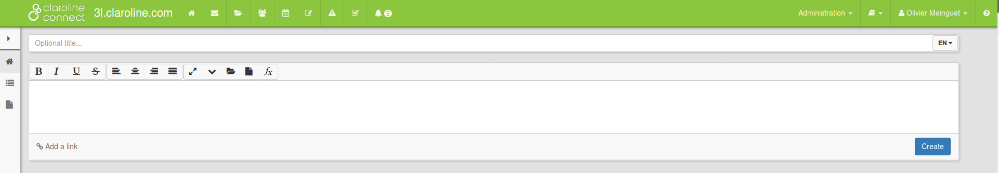

# The homepage

---

The homepage of the workspaces in Claroline Connect is made up of two toolbars:

* the top bar
* the toolbar of the left menu

Fig.1 - The toolbars in Claroline Connect.

La barre d'outils du bandeau supérieur permet l'accès aux principaux outils, ressources et espaces d'activités de la plateforme.
Elle est identique, quelle que soit la page sur laquelle vous naviguez.

Figure 2 - Barre d'outils: bandeau supérieur

Cette barre peut être modifiée et personnalisée par l'utilisateur. (Voir "[Outils du bureau](../bureau/personnaliser_votre_bureau.md)".)

La barre d'outils du menu de gauche permet l'**accès aux outils et ressources** de l'espace d'activités concerné. Elle varie selon l'espace d'activités et selon que l'utilisateur soit gestionnaire ou pas de l'espace d'activités.
Le menu de gauche montre les outils dont dispose le **gestionnaire** d'un espace d'activités.
Le menu de droite montre un exemple de menu dont dispose un simple **utilisateur** d'un espace d'activités.

Figure 3 - Comparaison des menus de gauche des pages d'accueil des espaces d'activités.

