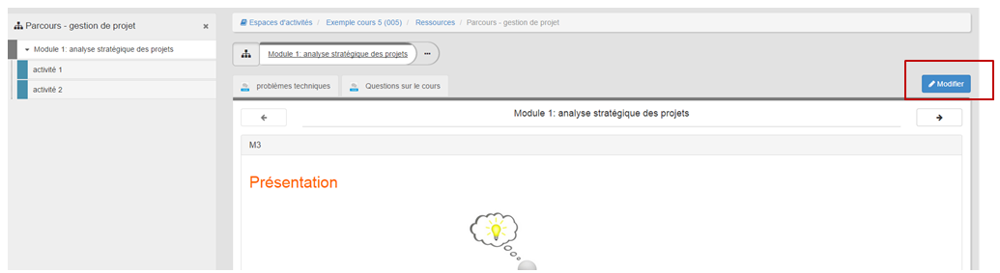

## Gérer les options d'une ressource
---

Vous pouvez accéder aux **options d'une ressource** en cliquant sur la petite flèche à droite de votre nom.

Figure 125 - Le choix d'options varie en fonction du type de ressource.

Le menu "**Options**" permet:

* de **télécharger** la ressource,
* de la **renommer**,
* d'**éditer ses propriétés**, c'est-à-dire de nommer ou renommer le fichier, choisir une icône de façon à personnaliser son apparence, définir une plage de publication.

Attention : les dates devront être formatées de la façon suivante : **AAAA-MM-JJ**.

Figure 126 - Éditer les propriétés d'une ressource.

* d'**éditer ses droits** pour en **personnaliser les accès utilisateurs**

Figure 127 - Gérer les droits d'une ressource

* de la **mettre à jour**. Pour mettre à jour un fichier sur Claroline Connect, nul besoin de supprimer l'ancienne version et de télécharger la nouvelle. Sélectionnez le fichier à mettre à jour, affichez les options et cliquez sur l'onglet "**Mettre à jour**". La démarche est ensuite la même que pour uploader un fichier sur la plateforme.

* de la **supprimer**,
* de l'**administrer**. C'est le cas du **Parcours**. En cliquant sur **Administrer**, on accède au parcours pour l'éditer / modifier.

Figure 128 - Editer un parcours

* de la **configurer**. C'est le cas du Blog. Vous pouvez accéder directement à la fonctionnalité de configuration du blog.

Figure 129 - Configurer un blog.

