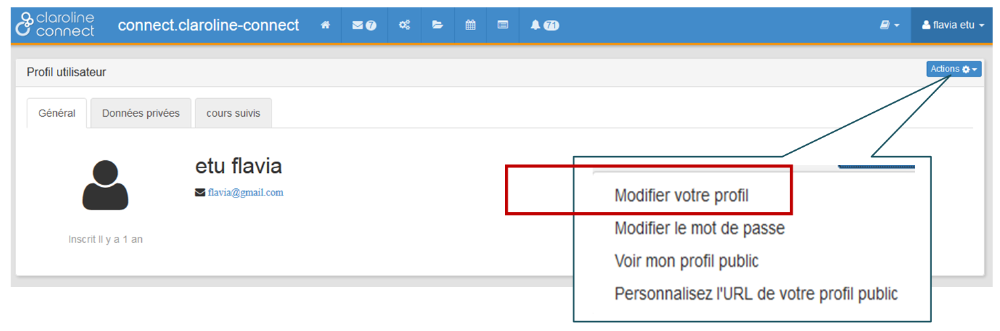
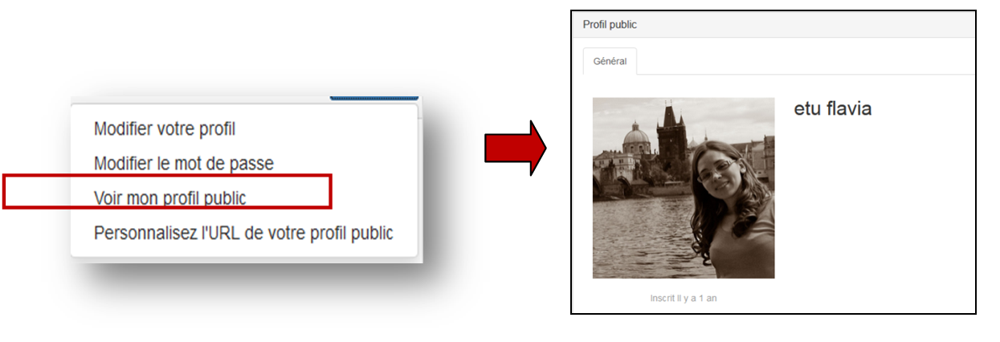

## Modifier votre profil utilisateur
---

Certaines informations du profil de l'utilisateur sont gérées par l'administrateur de la plateforme. C'est le cas, par exemple, pour les onglets "données privées" et "cours suivis". Vous pouvez effectuer vous-même d'autres modifications à partir du bouton "Actions".

Figure 79 - Modifications via le bouton "Actions".

Modifiez les données de votre profil à partir de l'option "Modifier votre profil". Un formulaire avec vos données personnelles s'affichera: prénom, nom, nom d'utilisateur, courriel.

Figure 80 - Remplir le formulaire des données personnelles.

Ajoutez une photo de profil en cliquant sur "Parcourir". Présentez-vous dans la partie "Description".
Vous pouvez également modifier votre mot de passe.

Figure 81 - Ajouter une photo.

Le mode "profil public" vous permettra de vérifier quelles informations personnelles sont visibles par les autres utilisateurs.
Pour faire cela, cliquez sur le bouton "Actions" et "Voir mon profil public".

Figure 82 - Vérifier les informations du profil public.

