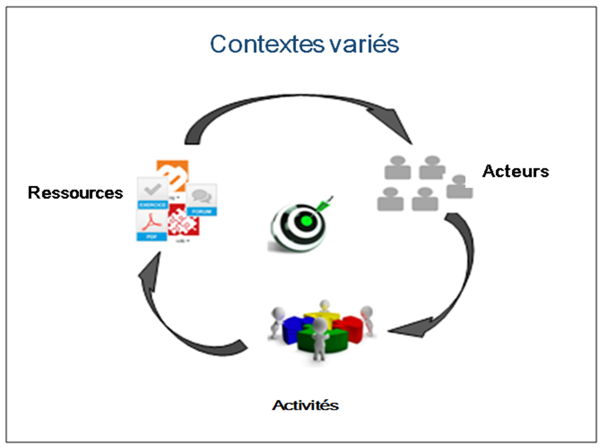

# Le concept des espaces d'activités

---
La plateforme Claroline Connect propose la notion d'**espace d'activités**, plus souple et adaptée aux contextes actuels.

Figure 36 - Schéma d'un espace d'activités

Il faut comprendre l'**espace d'activités** comme une valise contenant:

* des ressources (dossiers, fichiers, wikis, blogs, forums, etc.)
* des outils pour inscrire des utilisateurs et leur donner accès aux ressources, créer des équipes, réaliser des suivis, créer des référentiels de compétences, mettre en place des parcours, etc.

Dans cet espace d'activités, un ensemble d'acteurs (étudiants, formateurs, collaborateurs) peut réaliser différents types d'activités (exercices, projets, évaluations, recherches, co-working, discussions, débats, collaborations, partages, etc.) autour des objectifs définis.
Claroline Connect vous propose deux types d'espaces d'activités :

  * Votre espace personnel dont vous êtes le gestionnaire
  * Des espaces d'activités (publics) auxquels vous pouvez vous inscrire 

Un espace d'activités se compose de 2 éléments:

### La page d'accueil

Elle donne des informations sur le contenu et la structure de l'espace d'activités.

Figure 37 - Exemple de page d'accueil d'un espace d'activités.

### Le gestionnaire des ressources d'un espace d'activités

C'est la zone de dépôt ou de création des ressources (fichiers, forums, exercices, etc.) de l'espace d'activités qui peut être renseignée sur la page d'accueil de cet espace.

Figure 38 - Exemple de gestionnaire des ressources d'un espace d'activités.

