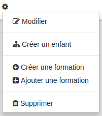
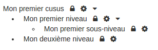
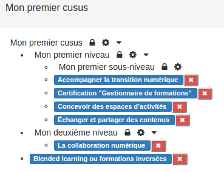

##### Créer des cursus
---
Maintenant que vous avez [créé votre cursus](admin-cursus.md), il va falloir le structurer en détails.

Pour passer à l'étape suivante, il vous suffit de cliquer sur le nom de votre catalogue. Vous afficherez une nouvelle page sur laquelle se trouve une seule ligne qui correspond au nom de votre cursus. Au bout de cette ligne se trouve un cadenas (si vous avez coché la case "bloquant" et une petite roue crantée. Cette première ligne est la "racine" de votre catalogue.

En cliquant sur la petite roue crantée, vous ouvrez un menu.

Comme d'habitude, vous avez la possibilité d'éditer ce que vous avez déjà fait créé.

Pour structurer votre cursus, vous aller devoir **créer des enfants** vous pourriez imaginer que cela correspond à des catégories, des sections ou encore des sous-titres dans votre catalogue de formations.

Quand vous aurez cliqué sur **créer un enfant** vous serez invité à remplir le même formulaire qu'à la [création de votre cursus racine](admin-cursus.md). Vous savez donc déjà comment le remplir. Cela aura pour effet de créer une niveau supplémentaire dans votre cursus. Vous pouvez continuer de cette manière jusqu'à avoir obtenu la structure souhaitée.N'hésitez pas à consulter [les exemples](examples.md) en fin de chapitre pour mieux comprendre cette étape importante.

Maintenant que vous avez créé le squelette de votre cursus, vous allez pouvoir y organiser les formations. Pour cela, cliquer sur la roue crantée du niveau auquel vous souhaitez associer des formations.

Deux options s'offrent alors à vous:

*    [Créer une formation](create-trainings.md)
*    Ajouter une formation (déjà existante dans la plateforme)

Si vous travaillé avec des formations déjà présentes dans la plateforme, vous ouvrir une liste des formations existantes. Vous pouvez filtrer la liste sur base du titre ou du code, il suffit de cliquer sur ajouter pour "ranger" la formation dans le cursus. Une même formation peut tout à fait être associé à deux endroits d'un même cursus. Pour plus de clarté à ce sujet, je vous invite une nouvelle fois à consulter [les exemples](examples.md)en fin de chapitre.

Au bout du compte, vous arriverez à un affichage ressemblant à ceci.

Concernant les cadenas, ils ont une influence sur le mécanisme d'inscription. Je vous invite donc à consulter la partie sur la [gestion des inscriptions](examples.md)pour bien comprendre leur fonction.

