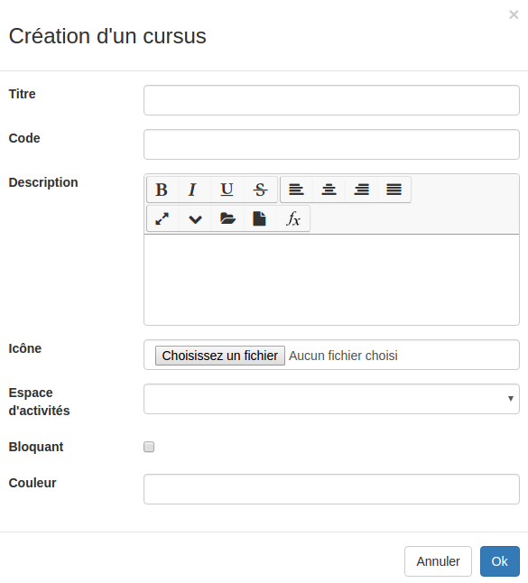

##### Créer des cursus
---
La première étape dans l'organisation de vos formations va consister en la conception de la structure de votre catalogue de formations (le cursus). Pour vous aider dans votre conception, n'hésitez pas à consulter [les exemples](examples.md) à la fin de ce chapitre.

Pour créer votre cursus, rendez-vous dans le menu d'administration et cliquez sur "gestion des formations".

Vous arriverez alors sur la page suivante:



Il s'agit de la page d'accueil depuis laquelle vous pouvez [créer mais surtout gérer vos formations](create-trainings.md). Nous y reviendrons dans la prochaine partie de ce manuel. 

En haut à droit de cette page, vous avez un menu composé de 4 icônes.
Cliquez sur le 3ème bouton (illustré en vert ci-dessous) pour accéder aux cursus. 



Vous arrivez alors sur une page qui liste tous les cursus (NDLR: "catalogues") que vous avez sur votre plateforme. 


A côté des noms se trouve une série d'actions possibles.

"L'oeil" permet de consulter rapidement la structure complète d'un cursus. 



"Le crayon avec la feuille" permet d'éditer les paramètres du cursus. 

"La corbeille quant à elle permet de supprimer complètement le cursus.

Au dessus de cette liste de cursus se trouve le menu principal.



* Créer un cursus:

Il s'agit bien évidement de l'action la plus importante. En cliquant sur ce bouton, vous ouvrez un formulaire de création.



Il vous faut avant tout définir un **titre** et un **code**. Ce code doit être unique.

Vous avez ensuite la possibilité d'associer une **description** et une **icône** (image) à votre cursus.

Vous avez la possibilité d'associer **un espace d'activités** existant à votre cursus. Cela aura pour conséquence que tous les étudiants inscrits dans ce cursus seront également inscrits dans cet espace d'activités. Selon vos besoins cet espace en particulier peut être un lieu d'échange ou de contenus administratifs...

Le fait de rendre votre cursus **bloquant** limitera l'inscription à ce niveau précis du catalogue. Nous y reviendrons plus en détail par la suite. 

Il vous reste encore la possibilité de choisir une **couleur** qui sera associée à ce cursus. 

