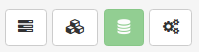
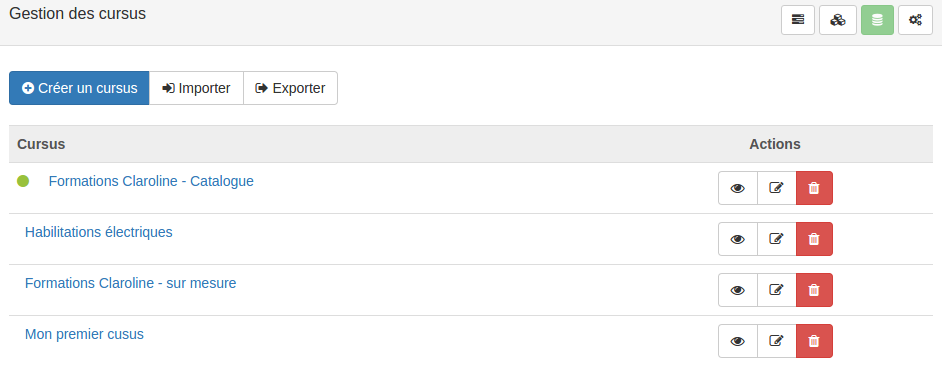
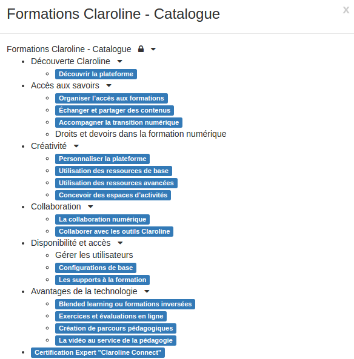
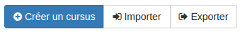

##### Créer des cursus
---
La première étape dans l'organisation de vos formations va consister en la conception de la structure de votre catalogue de formations (le cursus). Pour vous aider dans votre conception, n'hésitez pas à consulter [les exemples](examples.md) à la fin de ce chapitre.

Pour créer votre cursus, rendez-vous dans le menu d'administration et cliquez sur "gestion des formations".

Vous arriverez alors sur la page suivante:

Il s'agit de la page d'accueil depuis laquelle vous pouvez [créer mais surtout gérer vos formations](create-trainings.md). Nous y reviendrons dans la prochaine partie de ce manuel. 

En haut à droit de cette page, vous avez un menu composé de 4 icônes.
Cliquez sur le 3ème bouton (illustré en vert ci-dessous) pour accéder aux cursus. 

Vous arrivez alors sur une page qui liste tous les cursus (NDLR: "catalogues") que vous avez sur votre plateforme. 

A côté des noms se trouve une série d'actions possibles.

"L'oeil" permet de consulter rapidement la structure complète d'un cursus. 

"Le crayon avec la feuille" permet d'éditer les paramètres du cursus. 

"La corbeille quant à elle permet de supprimer complètement le cursus.

Au dessus de cette liste de cursus se trouve le menu principal.

