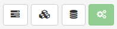
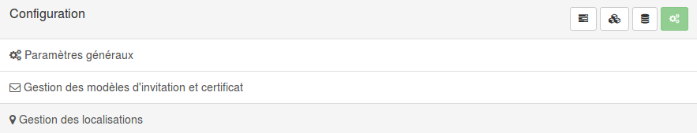
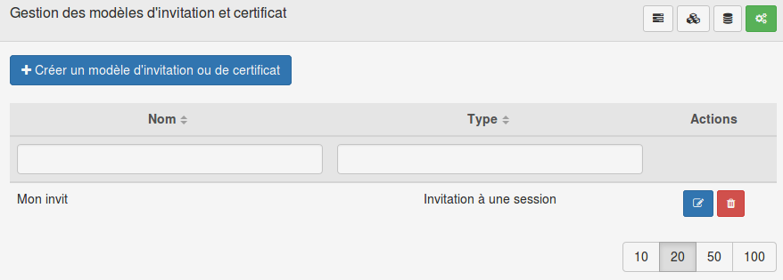
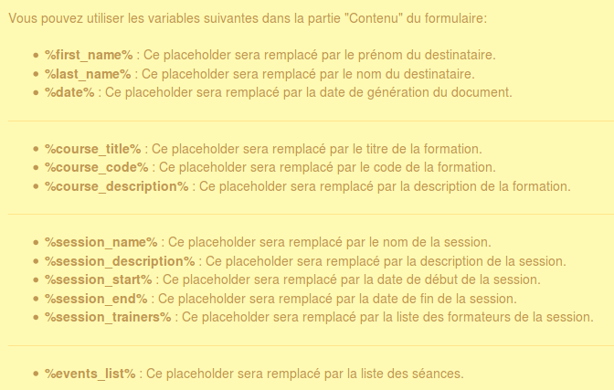
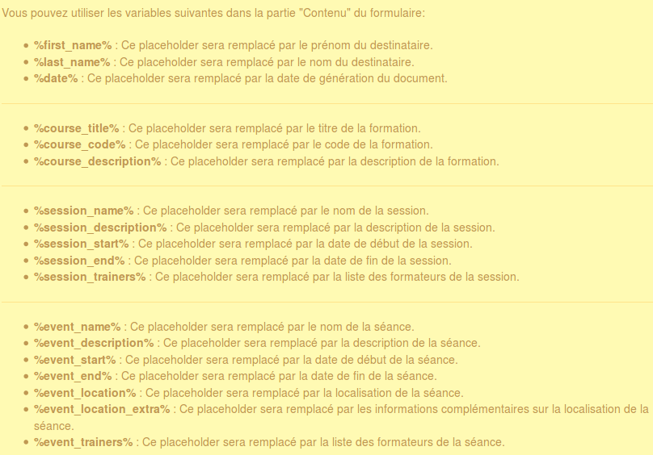
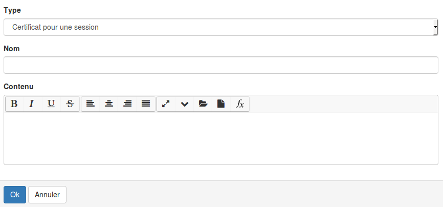
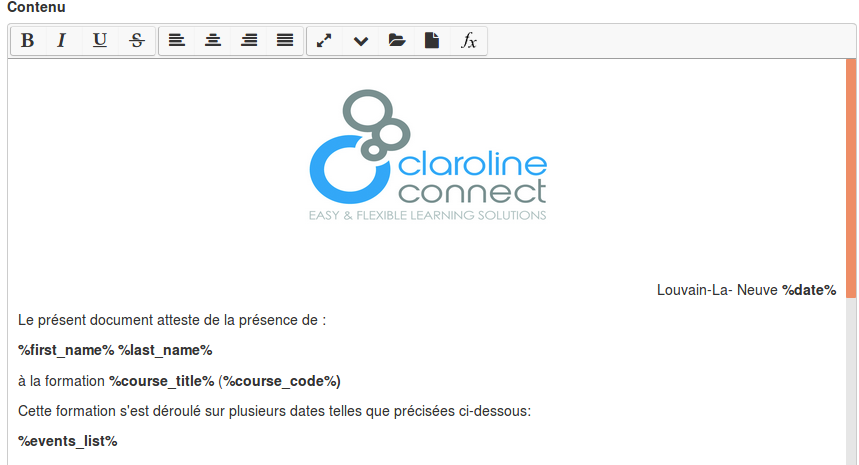
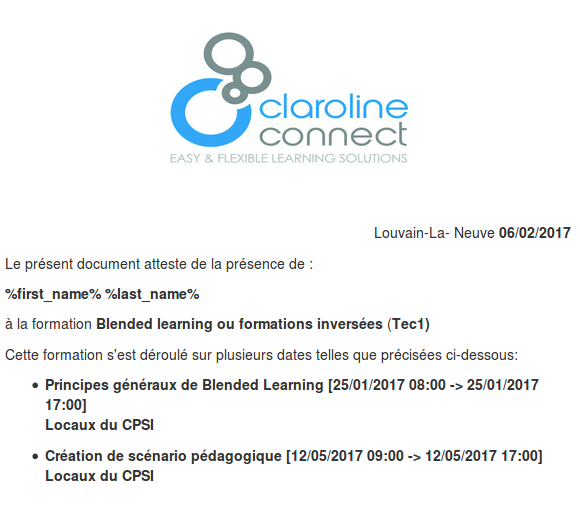

#### Gérer les modèles
---

Comme nous l'avons expliquer précédemment, il est possible d'envoyer, par mail, aux participants des invitations ou des attestations de présence. Ces documents sont entièrement personnalisable, et vous pouvez créer autant de variante que nécessaire.
Pour cela, vous allez créer des modèles qui seront automatiquement complétés avec les informations précises de chaque utilisateur et de chaque formation.+

Vous pouvez crééer quatre types différents de documents :
* Invitation à une séance
* Invitation à une session
* Certificat de participation à une séance
* Certificat de participation à une session

Si le principe de conception est le même dans tous les cas, les informations que vous allez pouvoir ajouter automatiquement au document sont différentes.
Chaque type de document ne peut être utilisé qu'à l'endroit adéquat.

>Par exemple si vous cliquez sur le bouton destiné à expédier une invitation à une séance, vous ne pourrez pas utiliser le modèle que vous avez créé pour le certification de cette même séance.

Concrètement, comment procèder ?

Pour créer un modèle, rendez-vous dans le menu d'administration et cliquez sur "gestion des formations".

Vous arriverez alors sur la page suivante:

Il s'agit de la page d'accueil du gestionnaire de formations.
En haut à droit de cette page, vous avez un menu composé de 4 icônes. Cliquez sur le 4ème bouton (illustré en vert ci-dessous) au menu de configuration.

Vous arrivez alors sur ce menu :

Cliquez maintenant sur "Gestion des modèles d'invitation et Certificat" pour arriver à la page de gestion des modèles.

L'affichage vous est proposé sous forme de tableaux. Chaque modèle possède comme vous pouvez le constater un nom et un type. Dans la colonne des actions, vous retrouvez deux boutons:

* Le crayon avec le bloc note pour éditer.
* La corbeille pour supprimer.

Pour créer un nouveau modèle, cliquez sur le gros bouton bleu en haut à gauche de la page "Créer un modèle d'invitation ou de certificat"

Cette action aura pour effet de vous ouvrir un formulaire découper en deux parties.

La première partie se présente sous le forme d'un encadré jaune qui vous propose des balises utilisables dans votre document. Ces balises seront remplacées dans le texte par la valeur correspondante à l'utilisateur ou à la formation adéquat.

*Balises pour les invitations/certificats à des sessions*

Comme expliqué précédemment, en fonction du type du modèle, que vous pouvez choisir dans la seconde partie du formulaire, les balises proposées ne seront pas les mêmes.

*Balises pour les invitations/certificats à des séances*

A vous maintenant de créer votre modèle en utilisant une ou plusieurs des balises proposées.

Choisissez le type de modèle que vous voulez concevoir.

>N'oubliez pas que du type de modèle va dépendre la diponibilité à l'un ou l'autre niveau (sessions/séances).

Donnez-lui un nom et passez à la rédaction.

Il ne vous reste plus qu'à valider votre modèle en cliquant sur le bouton "ok". Il sera maintenant disponible au niveau de la gestion des [sessions](/fr/admin/admin-trainings.md) ou des [séances](/fr/admin/admin-sessions-events.md).

Avant l'expédition, vous pourrez avoir un aperçu du courrier complété.

>Les balises %first_name% et %last_name% ne sont pas remplacées dans l'aperçu. Pas d'inquiétudes, c'est normal. Etant donné que plusieurs personnes peuvent être inscrites à une session/séance, la plateforme n'ajoute le nom qu'au moment de l'expédition. Donc, même si vous ne le voyez pas, votre utilisateur aura  bien son nom et son prénom dans la version qu'il recevra par Email.
