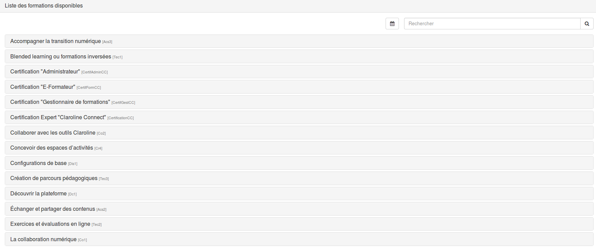
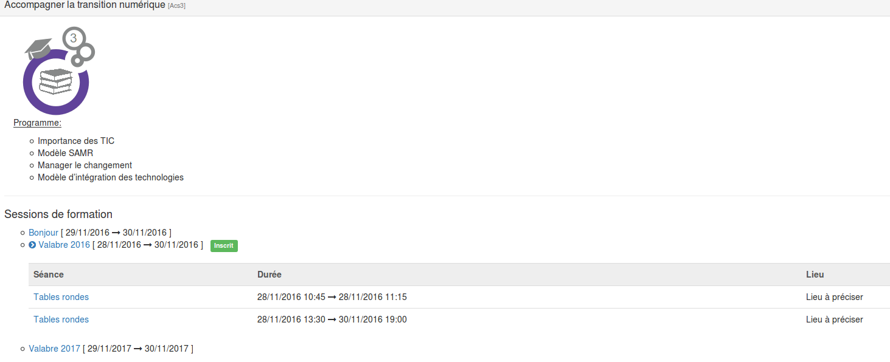
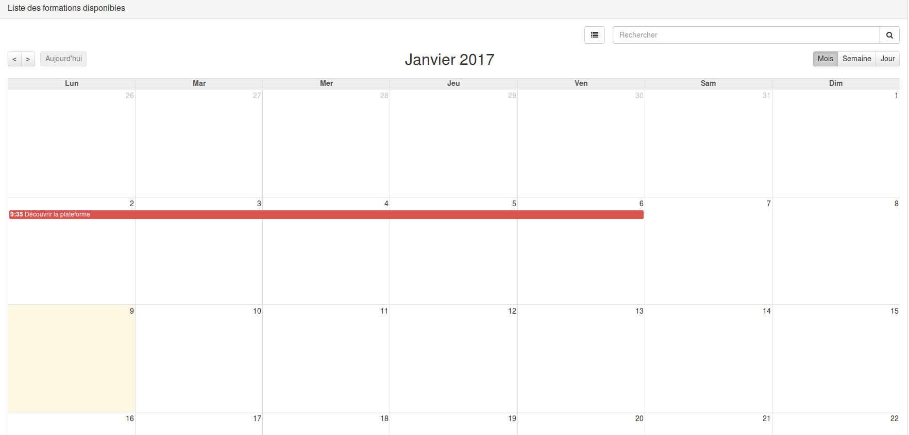
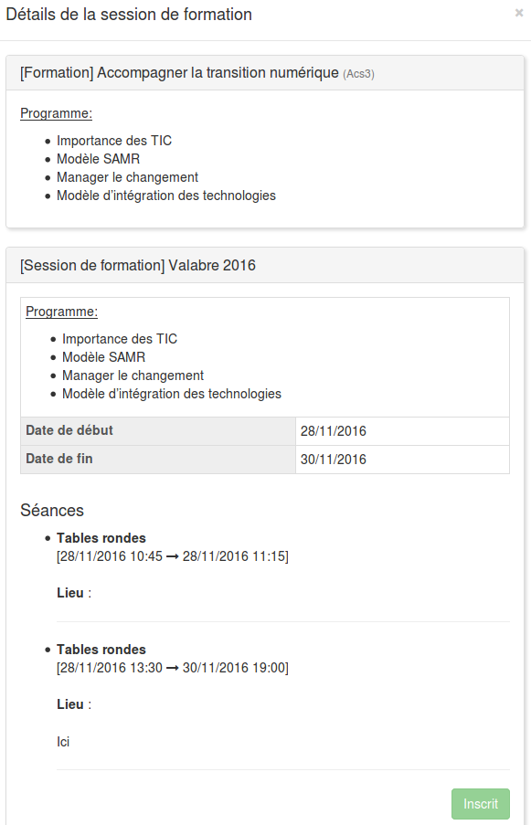

## Widget "Catalogue des formations"

---

Vous avez la possibilité d'afficher vos formations au sein d'un catalogue qui peut si vous le souhaitez être rendu consultable par les utilisateurs non-connectés à votre plateforme. Par ailleurs, pour les utilisateurs connectés, vous pouvez donner la possibilité de s'inscrire ou de se pré-inscrire aux formations que vous organisez.

Si vous souhaitez ajouter le widget "catalogue", il n'y a rien de plus simple: rendez-vous sur votre bureau ou dans un espace d'activités, suivez [la démarche habituelle](/fr/desktop/create-widget.md) et choisissez le type "liste des formations".

Deux modes d'affichages sont proposés :

* L'affichage catalogue:

Comme vous le constatez, il s'agit d'une simple liste reprenant les différentes formations. En cliquant sur un intitulé, vous pouvez avoir plus de détails.

Dans cet exemple, plusieurs formations sont organisées. Si aucune formation n'est proposée mais que vous souhaitez malgré tout que vos utilisateurs puissent s'inscrire, c'est possible. Dans ce cas ils s'inscrivent dans l'attente de l'ouverture d'une session de formation.

* L'affichage calendrier:

Pour avoir les détails d'une formation ou s'inscrire, il suffit de cliquer dessus dans le calendrier.

