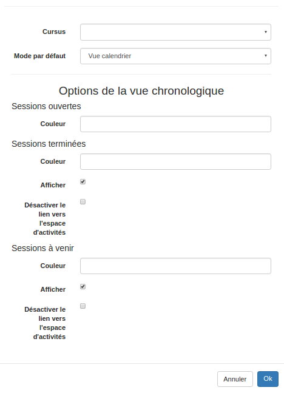
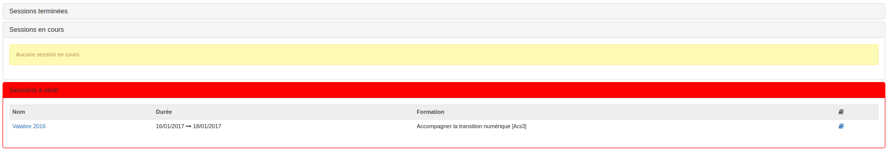

#### Configurer le Widget "Mon programme"

---

Pour configurer \(si vous en avez les droits\) ce widget, c'est très simple. Il vous suffit de cliquer en haut à droite sur l'icône en forme de crayon. Vous verrez alors ce formulaire:

Nous avons ici volontairement fait l'impasse sur les premiers champs du formulaire qui permettent de paramétrer le nom et l'affichage du nom pour nous concentrer sur les items plus spécifiques.

* Cursus: Vous permet de choisir de quel [cursus](/fr/admin/create-cursus.md) vous souhaitez afficher les formations. Vous devez pour cela les avoirs créés au préalable. 

* Mode par défaut: Vous permet de choisir si, par défaut, le widget affichera la vue liste ou la vue calendrier. 

> L'utilisateur aura toujours la possibilité de passer d'un affichage à l'autre.

Vous avez ensuite la possibilité de paramétrer différents éléments propres à l'affichage "chronologique".

Dans les trois cas, le champ **"couleur"** vous permet de paramétrer la couleur dans l'encadré.

Dans les cas des sessions terminées ou à venir, vous pouvez également décocher la case **"afficher"** si vous ne souhaitez pas que les sessions concernées soient visibles dans le widget.

La dernière option qui vous est proposée **"Désactiver les liens vers l'espace d'activités"** permet de cacher le bouton (ndrl: livre bleu) d'accès aux espaces d'activités liés aux sessions concernées. 

