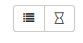
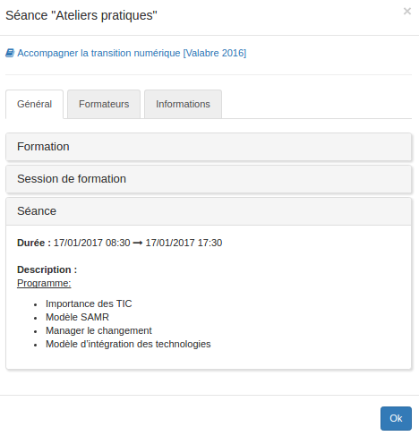
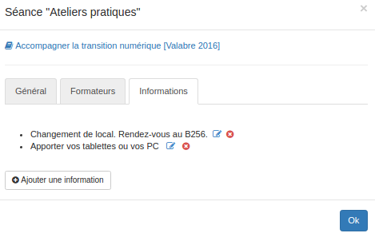

### Widget "Mon programme de formation"

---

A travers ce second widget, l'utilisateur a la possibilité d'afficher son programme personnalisé. Qu'il s'agisse d'un apprenant ou d'un formateur, l'utilisateur pourra ainsi retrouver facilement des informations telles que les dates et lieux de ses formations, les formateurs qui les animent ou encore accéder rapidement aux espaces d'activités en relation avec lesdites formations. 

Si vous souhaitez ajouter le widget "Mon programme", il n'y a rien de plus simple: rendez-vous sur votre bureau ou dans un espace d'activités, suivez [la démarche habituelle](/fr/desktop/create-widget.md) et choisissez le type "Mes formations".

Pour ce widget, trois affichages différents sont possibles. Les utilisateurs peuvent facilement passer d'un affichage à l'autre à l'aide des boutons situés en haut à droite.    

* L'affichage alphabétique

Cet affichage est en tous points semblable à celui du widget [catalogue de formations](/fr/admin/cursus/widget-formationslisting.md) sauf qu'il n'affiche que les formations dans lesquelles l'utilisateur est inscrit.

* L'affichage chronologique

Cet affichage propose de classer les différents formations auxquelles l'utilisateur est inscrit en fonction de leur statut: terminées, en cours, ou à venir. L'affichage de ce mode-là peut être légèrement différent selon la manière dont [le widget est configuré](/fr/admin/cursus/widget-myformations-config.md).
* L'affichage calendrier

L'affichage dans le calendrier est organisé selon un code couleur. 
* vert: indique le début d'une session
* rouge: indique la fin d'une session
* bleu : indique une séance

> Pour les formateurs, certains éléments peuvent également apparaître en gris. Il s'agit de séances pour lesquelles l'utilisateur n'est pas explicitement indiqué comme formateur mais qui font partie d'une session pour laquelle il l'est. 

Depuis la vue calendrier, il suffit de cliquer sur une session ou une séance pour avoir tous les détails. 

L'onglet "Formateurs" permet de prendre contact directement avec le ou les formateurs responsables de la séance.

L'onglet "Informations" permet aux formateurs de laisser des commentaires ou des précisions pour la séance.

**Quel que soit l'affichage, il suffit de cliquer sur le lien illustré par un petit livre bleu pour accéder directement à l'espace d'activités lié.**

