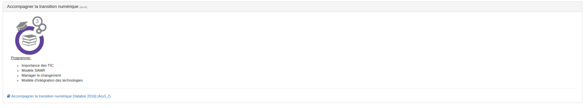
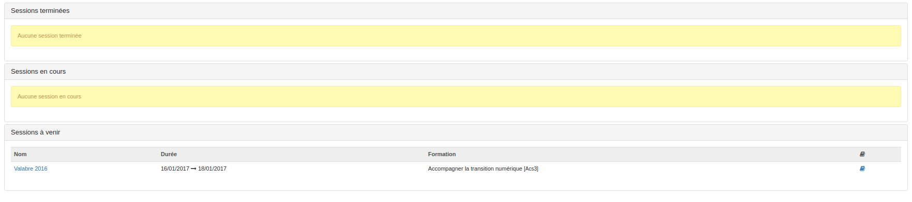
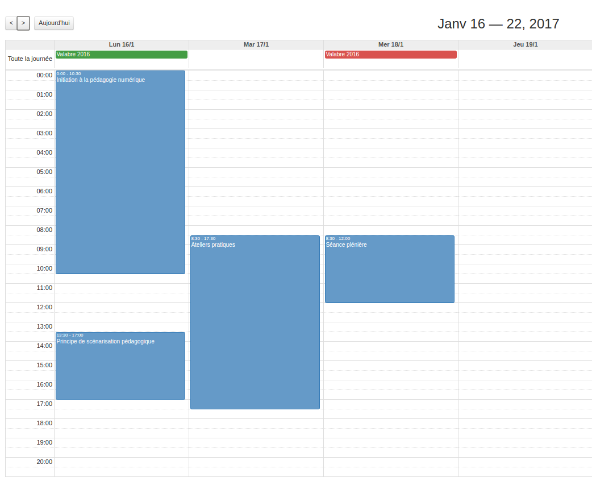

## Widget "Mon programme de formation"

---

A travers ce second widget l'utilisateur à la possibilité d'afficher son programme personnalisé. Qu'il s'agisse d'un apprenant ou d'un formateur, l'utilisateur pourra ainsi retrouver facilement des informations telles que les dates et lieux de ces formations, les formateurs qui les animent ou encore accéder rapidement aux espaces d'activités en relation avec lesdites formations. 

Si vous souhaitez ajouter le widget "Mon programme", il n'y a rien de plus simple: rendez-vous sur votre bureau ou dans un espace d'activités, suivez [la démarche habituelle](/fr/desktop/create-widget.md) et choisissez le type "mes formations".

Pour ce widget, trois affichages différents sont possibles.

* L'affichage alphabétique

Cet affichage est en tout point semblable à celui du widget [catalogue de formations](/fr/admin/cursus/widget-formationslisting.md) sauf qu'il n'affiche que les formations dans lesquelles l'utilisateur est inscrit.

* L'affichage chronologique

Cet affichage propose de classer les différents formations auxquelles l'utilisateurs est inscrit en fonction de leur status: terminées, en cours, ou à venir. L'affichage de ce mode là peut être légèrement différent selon la manière don [le widget est configuré](/fr/admin/cursus/widget-myformations-config.md).
* L'affichage calendrier

L'affichage dans le calendrier est organisé selon un code couleur. 
* vert: indique le début d'une session
* rouge: indique la fin d'une session
* bleu : indique une séance

> Pour les formateurs, certains éléments peuvent également apparaître en gris. Il s'agit de séances pour lesquelles l'utilisateur n'est pas explicitement indiqué comme formateur mais qui font partie d'une session pour laquelle il l'est. 