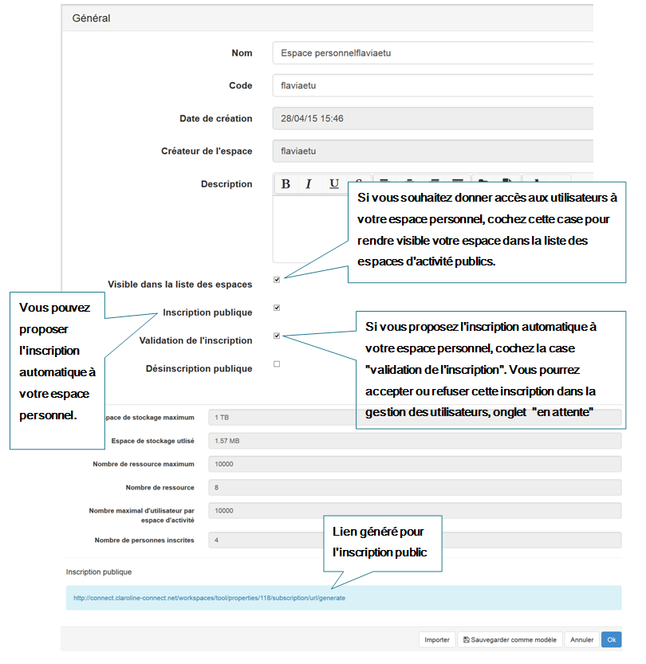
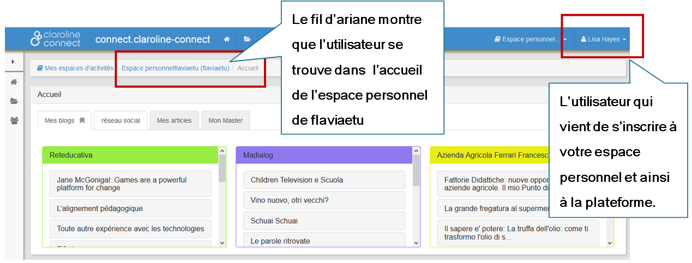
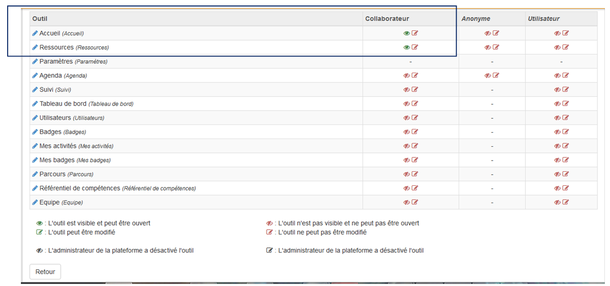

## Paramétrer votre espace personnel

---

Cliquez sur l'icône "**paramètres**" du menu de gauche de votre espace personnel. Il est composé de **4 éléments** :

* **Général**
* **Outils**
* **Modèles**
* **Ressources**

Figure 25 - Paramètres de votre espace personnel

### a. Paramétrage général de l'espace personnel

Il permet de modifier les informations recueillies au moment de la création de l'espace d'activités \(nom, description, modalités d'inscription, etc.\) Il est par exemple possible de transformer un espace privé **en espace public**, ou de générer un lien permettant l'inscription publique à l'espace d'activités.

Figure 26 - Paramétrage général de l'espace personnel

** Rendre votre espace personnel public - Inscription publique**

Il est par exemple possible de transformer un espace privé en **espace public** ou de générer un lien permettant l'inscription publique à l'espace d'activités. Pour ce faire, il faut cocher la case "**inscription publique**".

Lorsque vous cochez la case "Inscription publique", **un lien d'inscription est généré**.

  
**Inscriptions des anonymes \(ceux qui ne sont pas inscrits à la plateforme\).**

  
Vous donnerez le lien généré aux internautes pour s'inscrire à votre espace ainsi qu'à la plateforme.

Lors de l'inscription publique, l'anonyme accédera directement au formulaire d'inscription à la plateforme.

Figure 27 - Inscription à un espace d'activités par un anonyme

Une fois que le formulaire est rempli le nouveau utilisateur accédera directement à votre espace personnel.

Figure 28 - Le nouvel utilisateur accède à votre espace personnel

### b. Configurer les droits des outils

Il permet de configurer le droits des différents profils \(Collaborateur, Anonyme, Utilisateur\) sur les différents outils \(Accueil, Ressource, Paramètres, Agenda, Suivi, Tableau de bord, Utilisateurs, Badges, Mes badges, Mes activités, Parcours\). \(Voir les profils de Claroline Connect\)

Cela permet par exemple de rendre un contenu accessible à tous les anonymes, y compris ceux qui ne sont pas identifiés ou inscrits.

Comme expliqué dans les références:

Dans l'exemple ci dessous, seuls l'**Accueil** et les **Ressources** sont visibles par le profil "**Collaborateur** " qui ne peut rien éditer/modifier. En revanche, les profils "Anonyme" et "Utilisateur" n'ont aucune permission.

Figure 29 - L'Accueil et les Ressources sont visibles par le profil "Collaborateur"

**Renommez les outils du menu de votre espace personnel.**

Il est possible de renommer chaque outil en cliquant sur le crayon bleu: 

Figure 30 - Ajouter le nom souhaité pour l'outil sélectionné

### c. Créer un modèle d'espace d'activités \(Créateur d'espaces d'activités\)

Pour ceux qui ont le droit de créer des espaces d'activités, cet outil permet de créer un modèle d'espace d'activités comportant des ressources, onglets et widgets par défaut.

### d. Gérez l'accès aux ressources

Il permet de gérer les droits d'accès aux ressources en fonction des profils, des espaces ou des utilisateurs. Il est possible de régler finement ces droits par type d'action \(ouvrir, copier, exporter, éditer, supprimer\) et par type de ressource \(en cliquant sur “Options”\). Rappelons que l'on peut éditer les droits d'un fichier particulier depuis le répertoire de ressources \(cf. menu déroulant du fichier concerné\).

