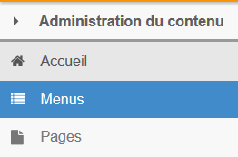
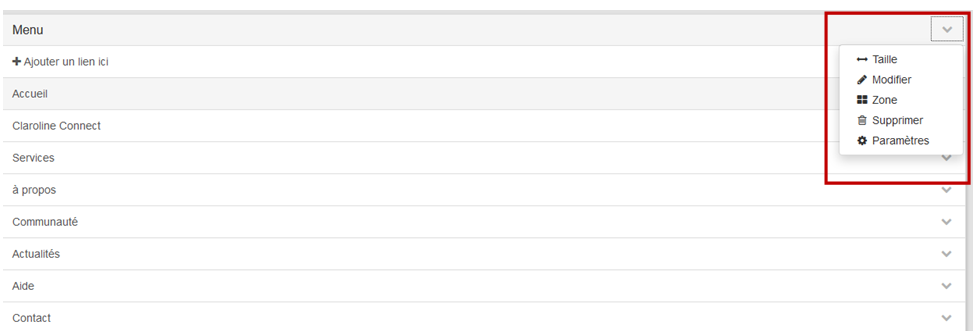

## Créer des menus

---

Pour **créer un menu**, cliquez sur l'icône "**Menus**" de la barre latérale d'outils située à gauche de la page.

Figure 150 - Icône "Menu" de la bare latérale gauche.

Entrez ensuite un titre à l'emplacement "**Titre du menu**", puis cliquez sur "Créer" dans la fenêtre centrale.

Figure 151 - Donner un titre au menu.

Votre nouveau menu est ajouté à la suite des autres.

Figure 152 - Résultat de l'ajout d'un menu.

Vous pouvez désormais lui ajouter du contenu, c'est-à-dire des liens vers d'autres sites web ou vers les pages que vous allez créer sur votre plateforme ou qui y sont déjà présentes.

Figure 153 - Ajout de liens

Il vous faut alors:

* taper un **titre**;

* coller ou taper l'**URL** de la page concernée \(l'adresse du lien\);

* cliquer sur le bouton "**Créer**".

### **Positionnement du menu**

Il est possible placer le menu :

* en entête
* à gauche
* à droite
* en pied de page

1\) Cliquez sur la flèche à côté du menu et ensuite sélectionnez "**zone**":

Figure 154 - Sélection de la zone de menu.

2\) Choisissez la zone \(par exemple "**entête**"\) :

Figure 155 - Sélection de la zone de menu.

Le menu apparaîtra en haut de la page:

Figure 156 - Résultat du choix de la zone.

