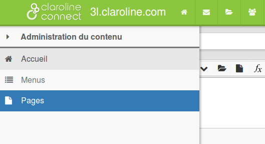

## Créer des pages

---

Une page peut contenir plusieurs articles et être ajoutée comme entrée dans un menu.

**1. Ajoutez une nouvelle page**

Pour créer une page, cliquez sur l'icône suivante de la barre d'outils:

Figure 160 - Ajouter une page.

Les pages de contenu apparaissent alors:

Figure 161 - Visualisation des pages existantes.

Dans l'exemple ci-dessus, une page "Claroline Connect" a été créée. Pour ajouter une nouvelle page, tapez un titre dans le champ indiquant "**Nouvelle page de contenu …**", puis cliquez sur **Créer**.

En cliquant sur le titre de la page (ici, Claroline Connect), vous ouvrez cette page en mode édition et vous pouvez:

* **ajouter des articles **à la page ou **modifier** (éditer) les articles existants;
* définir leur **taille** (largeur);
* définir la **zone** (comme les menus : en-tête, pied de page, etc.);
* ajouter un "Lire la suite" en cliquant sur "**Accordéon**";
* **déplacer** un article vers une autre page;
* **effacer** un article.

**2. Comment ajouter une page comme entrée d'un menu ?**

Si vous ne créez pas de nouvelle page, vous n'aurez qu'une page d'accueil \(home\) qui affichera les différents articles et menus contenant des liens externes.

Pour ajouter une page contenant un ou plusieurs articles à l'un des menus, vous devez connaître son adresse (URL). Vous avez en effet remarqué que l'ajout d'entrée aux menus se faisait par la commande **Ajouter un lien**. Mais où trouver l'adresse d'une page? Il vous suffit de cliquer sur le nom de la page depuis "Pages de contenu" (cf. image précédente). La page concernée s'affiche alors. Vous pouvez récupérer l'URL dans la barre d'adresse du navigateur. Mais il n'est pas utile de tout recopier lorsque vous ajoutez un lien au menu. Vous pouvez vous contenter de coller le texte qui se trouve après "type/" comme indiqué en gras dans l'exemple qui suit:

.../claroline-connect/web/app.php/type/**Claroline%20Connect**

