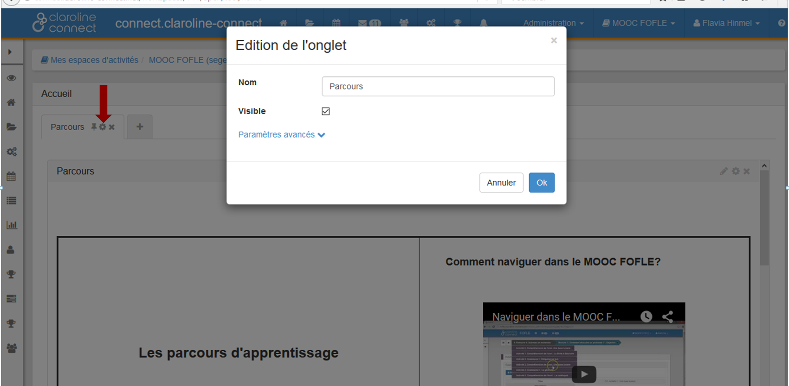

## Paramétrer les droits de la page d'accueil
---

Vous pouvez également paramétrer les onglets de la page d'accueil de votre espace d'activités. Ainsi, vous pouvez créer plusieurs onglets qui seront destinés à différents profils.

Vous proposerez donc des pages d'accueil différentes en fonction du profil.

Cliquez sur l'icône de la roue crantée pour éditer l'onglet.

Figure 5 - Éditer un onglet sur la page d'accueil.

Cliquez ensuite sur "**Paramètres avancés**" et **choisissez le rôle**.

Figure 6 - Paramétrer les rôles d'un onglet sur la page d'accueil.

**Attention:** Si aucun rôle n'est coché, l'onglet sera disponible pour tous les utilisateurs. Sinon, il sera uniquement disponible pour les utilisateurs ayant un des rôles sélectionnés.
