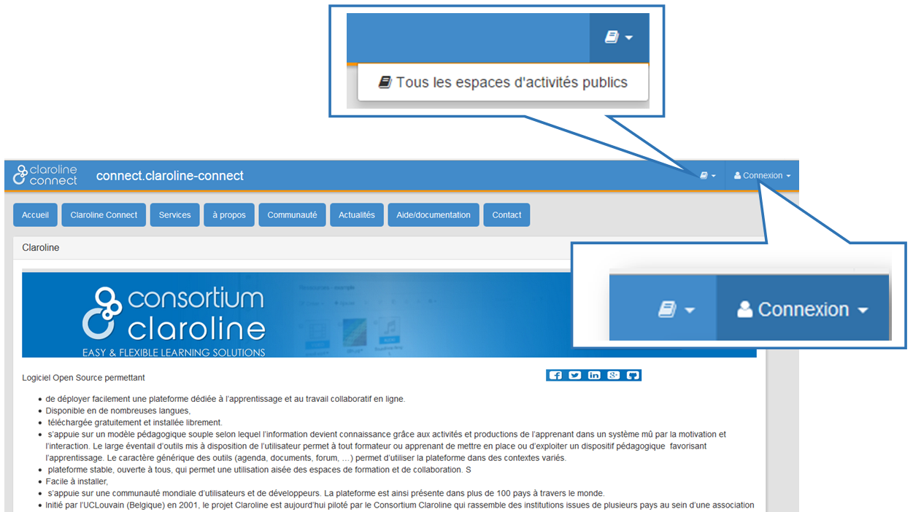

## Connexion à une plateforme
---

Pour vous connecter à une plateforme, cliquez sur "Connexion" en haut à droite de la page d'accueil.

Dans la plupart des plateformes Claroline Connect, le bouton connexion est visible en haut à droite de la page d'accueil.
Dans certains cas, il est également possible d'accéder aux espaces d'activités publics à partir de la même page.

Figure 70 - Connexion à une plateforme

Utilisez l'identifiant et le mot de passe fournis par l'administrateur et cliquez sur "Connexion".

Figure 71 - Entrer nom d'utilisateur et mot de passe.

