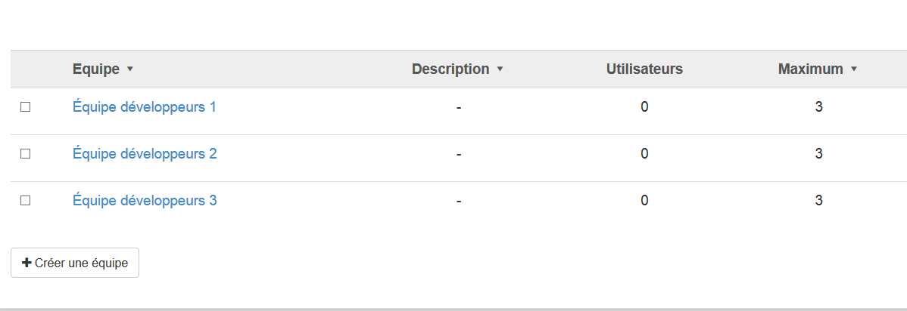

## Créer des équipes
---

Pour organiser les utilisateurs de votre espace d'activités personnel de manière générale ou autour d'un projet ou cours, vous pouvez utiliser l'**outil équipe**. Il vous permet de:

* créer une équipe à la fois
* créer plusieurs équipes en même temps

Figure 100 - Créer une ou plusieurs équipes.

Il est possible de fixer le nombre maximum d'utilisateurs par équipe et de leur assigner des ressources. Dans l'exemple, l'équipe "**Équipe pédagogique**" sera créé.

Figure 101 - Fixer un nombre d'utilisateurs par équipe.

Affichez les paramètres avancés pour paramétrer l'équipe:

Figure 102 - Paramètres avancés des équipes.

Dans l'exemple ci-après, l'équipe "**Équipe pédagogique**" a été créée.

Figure 103 - Exemple de création d'équipe.

Il est également possible de créer plusieurs équipes en une fois en cliquant sur le bouton "**Créer des équipes**". Dans l'exemple ci-dessous, les équipes "**Équipe développeurs 1,2 et 3**" ont été créées.

Figure 104 - Création de plusieurs équipes d'une traite.

#### Création d'un répertoire de ressources

En suivant les exemples précédents, lors de la création d'une équipe, un répertoire de ressources est créé par défaut dans le gestionnaire de ressources de l'espace d'activités.

Figure 105 - Répertoire de ressources créé par défaut.

#### Création des rôles

Lors de la création des équipes, les rôles **Equipe pédagogique** et **Equipe pédagogique manager** ont été créés pour faciliter la gestion des ressources des équipes. (Consultez gestion des ressources)

Figure 106 - Création des rôles pour les équipes.

