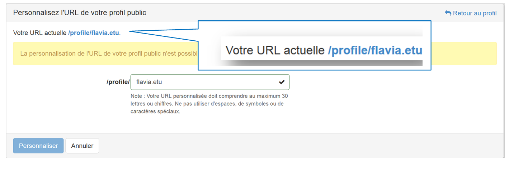
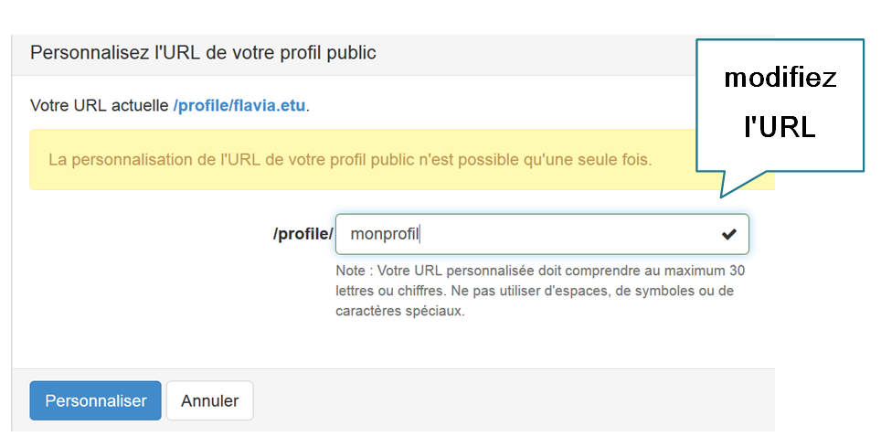

## Modification de l'URL de votre profil public
---

Vous avez par défaut une URL (Uniform Resource Locator, c'est-à-dire votre adresse web) pour afficher votre profil public. En cliquant sur **Personnaliser l'URL de votre profil public**, vous accédez à votre adresse.

Figure 83 - Personnaliser l'URL de votre profil public.

Dans l'exemple ci dessus, l'URL est la suivante :

Figure 84 : Exemple d'URL de profil public.

Il est donc possible de personnaliser l'URL de votre profil en cliquant sur le champ : /profile/

Figure 85 : Choisir son profil.

Tenez bien compte du message suivant :

Figure 86 : Notification de personnalisation du profil public.

