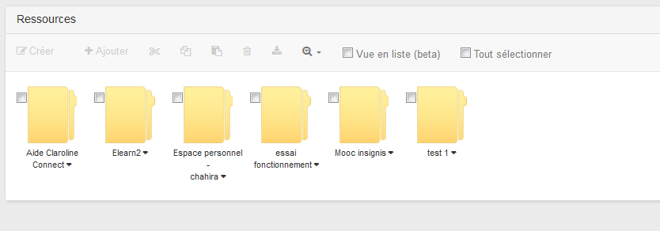

## Accéder au gestionnaire des ressources

---

Il existe deux manières d'accéder au gestionnaire de ressources

* en cliquant sur l'icône **"ressources" **de la barre du menu à gauche d'un espace d'activités, vous accédez directement au **répertoire de ressources** de cet espace;

* en cliquant sur l'icône **"ressources"** de la barre de propriétés de votre bureau (bandeau supérieur), vous accédez à l'espace général des** "Ressources" de la plateforme** (qui contient par défaut les répertoires de tous les espaces d'activités créés).

Figure 119 - Accéder au répertoire de ressources d'un espace ou accéder à l'espace général des ressources de la plateforme

Figure 120 - Espace général des ressources de la plateforme

