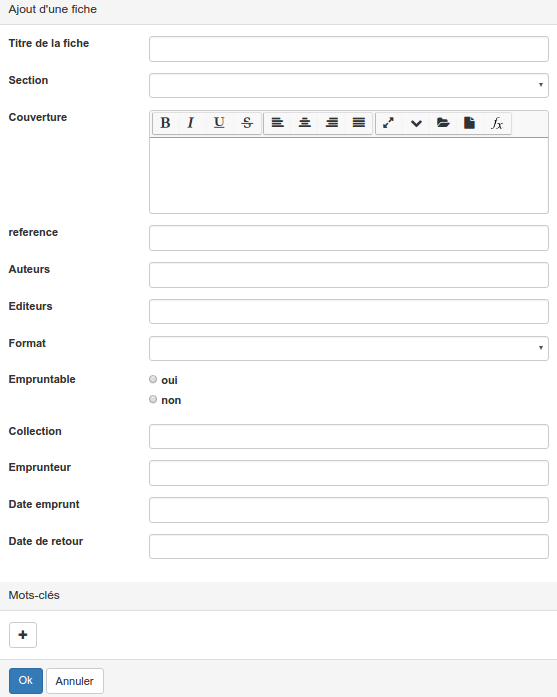

### Ajouter une fiche

---

Une fois que vous avez cliqué sur "Ajouter une fiche" vous vous retrouvez face au formulaire tel que le gestionnaire l'a conçu.

Il ne vous reste plus qu'à :

* Remplir les différents champs. 
* Eventuellement ajouter un ou des mots-clés si le gestionnaire vous en a donné le droit.
* Et enfin cliquer sur le bouton "OK" bleu en bas à gauche pour enregistrer votre fiche.

Par la suite, vous [pouvez facilement retrouver](/fr/resources/clacoForm/manage-files.md) toutes les fiches que vous avez déposées.

