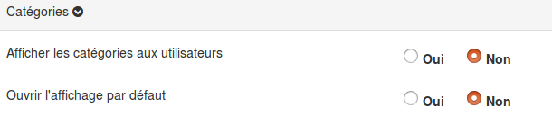

##### Catégories
---

**Afficher les catégories aux utilisateurs** permet d'ajouter un panel dans le bas de la fiche avec les catégories attribuées à la fiche.

**Ouvrir l'affichage par défaut** permet de déterminer si le panel est par défaut ouvert ou fermé.

> Les collaborateurs ne peuvent jamais attribuer ou modifier les catégories d'une fiche. La catégorie est un outil organisationnel à destination des gestionnaires.