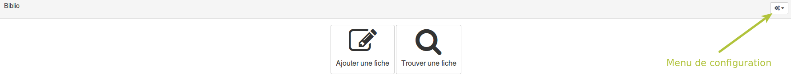

### Mettre un formulaire en place

---

La première étape consiste à vous rendre dans la partie **Ressources** d'un espace d'activités. Il vous suffit ensuite de cliquer sur le bouton **Ajouter** et de sélectionner le formulaire.

Une fois votre formulaire ajouté dans vos ressources, cliquez dessus pour commencer le paramétrage.

La page sur laquelle vous arrivez est également, par défaut, celle qui sera proposée aux collaborateurs de votre espace. La seule différence est que vous avez accès à un menu de configuration en haut à droite.

C'est depuis ce menu que vous allez pouvoir piloter l'ensemble de la ressource.

La première chose que vous devez faire, c'est ajouter des champs à votre formulaire. Pour cela, rendez-vous dans le menu **Gestion des champs**.

