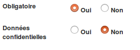
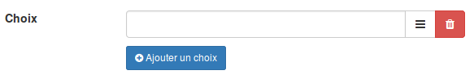

## Création des champs

---

Dans notre exemple, de nombreux champs sont déjà disponibles. Si vous venez de créer la ressource, ce tableau devrait être complètement vide.

En bas à gauche, vous trouverez un bouton bleu intitulé "Créer un champ". En cliquant dessus, vous ouvrirez un formulaire.

Vous devez d'abord attribuer un nom à votre champ.\(Sans accent et sans astrophe\)

Ensuite, vous devez choisir le type de champ. Vous pouvez constater qu'il en existent de différents types.

* Texte: Il s'agit d'un simple cadre dans lequel peut être encodé n'importe quel type d'information.
* Nombre: Dans ce champ, ne seront acceptés que les nombres.
* Date: Ce champ permet d'afficher un calendrier dans lequel l'utilisateur peut choisir une date.
* Bouton radio: Les boutons radios sont des petits ronds à cocher. Un seul choix peut être sélectionné.
* Liste déroulante: Les listes déroulantes permettent d'afficher des choix les uns en dessous des autres.
* Checkboxes: Elles sont basées sur le même principe que les boutons radio, mais dans ce cas, plusieurs choix peuvent être sélectionné en même temps.
* Pays: Il s'agit d'une liste déroulante pré-complétée avec les pays.
* Courriel: Un champ texte qui n'accepte que des contenus structurés en adresse courriel. Exemple : monadresse@quelquechose.be
* Texte riche: Il s'agit d'un champ texte dans lequel vous avez [l'éditeur complet de la plateforme](/fr/resources/text-editor.md).

Il vous reste encore 2 petites choses à régler:

L'attribut "obligatoire" obligera le collaborateur à remplir le champ.

L'attribut "données confidentielles" permettra \(par défaut\) de ne rendre la réponse de ce champ visible que par les gestionnaires de la ressource.

##### Cas particuliers : les listes, les boutons radios et les checkboxes

Quand vous choisissez ce type de champ, vous devez encore encoder les choix qui seront proposés à vos utilisateurs.

Vous pouvez évidement ajouter autant de choix que vous le voulez.

Il vous est également possible d'associer une catégorie à un choix. Cela aura pour effet, lors de la sélection du choix, d'automatiquement attribuer [la catégorie](/fr/resources/form-category.md). associée à la fiche.

Si vous souhaitez associer un choix à [une catégorie](/fr/resources/form-category.md), il vous suffit de cliquer sur les 3 petits traits noirs à côté de la corbeille. Une liste vous propose alors de sélectionner [la catégorie](/fr/resources/form-category.md) souhaitée. Pour cela il faut avoir préalablement créé vos [catégories](/fr/resources/form-category.md).

Pour supprimer l'association, il suffit de cliquer sur les 3 traits blancs sur fond orange.

