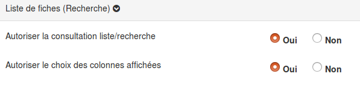

##### Liste des fiches

---

**Autoriser la consultation liste/recherche** permet d'autoriser les collaborateurs à consulter d'autres fiches que celles qu'ils ont créées.

**Autoriser le choix des colonnes affichées** permet d'autoriser les collaborateurs à ajouter des champs supplémentaires sur lesquels peuvent être effectuées des recherches.

Pour plus de précisions sur la recherche, rendez-vous dans la partie de ce manuel consacrée à la [gestion des fiches-réponses](/fr/resources/clacoForm/manage-files.md).

