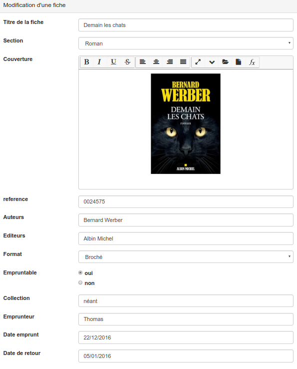
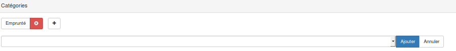
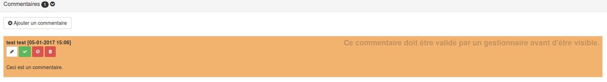

### Gérer les fiches réponses

---

La liste des fiches permet de consulter, chercher, éditer, ou encore supprimer les fiches existantes.

Selon les configurations et vos droits d'accès, trois tableaux peuvent vous être proposés. Pour choisir la liste que vous souhaitez afficher, il vous suffit de la sélectionner dans le menu déroulant en haut à gauche.

Les trois tableaux possibles sont:

* "Toutes les fiches" - Ce tableau vous donnera accès à l'ensemble des fiches disponibles. Depuis ce tableau, vous aurez uniquement la possibilité de consulter ces fiches. 
* "Mes fiches" - Depuis ce tableau, vous pourrez toujours accéder aux fiches que vous avez complétées. Selon les autorisations accordées, vous pourrez également les éditer ou les supprimer. 
* "Les fiches dont je suis gestionnaire" - Ce tableau vous permet d’accéder aux fiches appartenant à [une ou des catégorie\(s\)](/fr/resources/form-category.md) dont vous êtes gestionnaire. Depuis cet affichage, vous pouvez publier, archiver éditer ou encore supprimer les fiches dont vous êtes responsables.

> Dans ce dernier tableau, les fiches qui sont affichées sur fond orange sont en attente de validation avant publication.

##### Trouver une fiche

Chaque colonne du tableau correspond à un champ d'une fiche. Il vous suffit d'écrire la valeur que vous cherchée dans la colonne adéquate. Ces champs sont cumulatifs. Vous pouvez donc chercher par exemple toutes les fiches d'un utilisateur donné à une date donnée.

Par défaut, et par souci de lisibilité, tous les champs ne sont pas affichés. Si vous souhaitez ajouter les champs manquants, il vous suffit de cliquer sur le bouton filtre en haut à droite du tableau.

> Les champs de type "texte" ne sont pas accessibles par souci de lisibilité.
>
> En fonction des configurations, certains champs peuvent ne pas être accessibles à tous les utilisateurs.

##### Agir sur les fiches

Les différentes actions possibles sur les fiches sont indiquées dans la colonne action en bout de ligne.

L’œil permet de publier ou d'archiver la fiche. L'archivage consiste simplement à rendre la fiche "invisible" pour les utilisateurs. Dans le tableau, cela se traduit par une ligne barrée.

> Cette fonction n'est accessible qu'au gestionnaire de la ressource ou d'une catégorie.

Le crayon permet d'entrer en mode édition de la fiche. Selon vos droits, les parties éditables de la fiche ne seront pas nécessairement les mêmes.

* Le corps de la fiche : Cette partie contient tous les champs remplis de la fiche. 

* [Les mots-clés](/fr/resources/form-keyword.md) : Si le gestionnaire du formulaire en a autorisé l'usage, les mots-clés peuvent être supprimés ou ajoutés dans cette partie. 

* [Les catégories](/fr/resources/form-category.md) : Si le gestionnaire du formulaire en a autorisé l'usage, les catégories peuvent être supprimées ou ajoutées dans cette partie. 

> Cette fonction n'est accessible qu'au gestionnaire de la ressource ou d'une catégorie.

* [Les commentaires](/fr/resources/form-comments.md) : Si le gestionnaire du formulaire en a autorisé l'usage, les personnes qui ont déposé des commentaires peuvent les éditer. Si vous êtes gestionnaire de la catégorie à laquelle appartient la fiche, vous pouvez également supprimer, publier ou bloquer les commentaires. 

> Un commentaire qui doit être modéré est affiché sur un fond orange.   
> 
>
> Un nouveau commentaire qui doit être modéré est affiché sur un fond orange.

