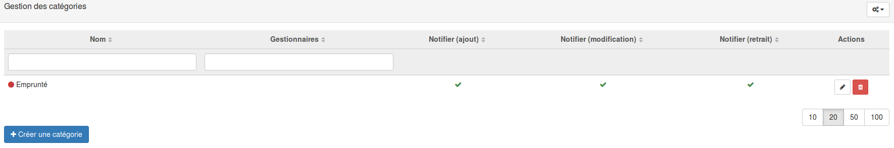
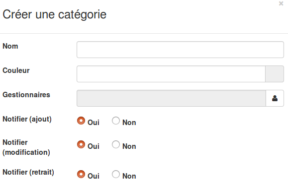

## Création des catégories
---
Afin d'organiser au mieux vos données, vous avez la possibilité d'organiser vos fiches dans des catégories.

Pour cela rendez-vous dans le menu "gestion des catégories".

Vous arrivez sur une page avec un tableau présentant toutes vos catégories existantes.

En bas à gauche, vous trouverez le bouton pour créer une nouvelle catégorie. En cliquant dessus, vous ouvrez un formulaire.

Vous devez donner un nom à votre catégorie et vous pouvez éventuellement lui associer une couleur.

On vous propose ensuite de sélectionner un ou des gestionnaire. Cette action facultative vous permet de donner des droits de gestion sur les fiches de cette catégorie à un ou des utilisateurs de votre choix. Ces utilisateurs pourront dès lors modifier, supprimer, modérer, publier ou encore archiver les fiches de la catégorie en question.

Les trois configurations suivante permettent de notifier les gestionnaires de la catégorie respectivement en cas d'ajout d'une nouvelle fiche dans cette catégorie, de modification d'une fiche de cette catégorie ou encore lors du retrait/suppression d'une fiche de cette catégorie. 