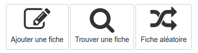

## Le formulaire

---

ClacoForm Fig.1 - Icône de la ressource Formulaire.

Le formulaire est une ressource destinée à récolter des données, les partager et interagir autour de ces informations. 

Les usages sont nombreux et on peut en lister quelques-uns de manière non-exhaustive: inscriptions à des évènements, gestion de co-voiturage, fiches de synthèse matière, enquêtes, gestion de bibliothèque ou encore recueil de témoignages.

Quand vous entrez dans la ressource, vous aurez le choix, selon les configurations entre plusieurs fonctions:

* [Ajouter une fiche](/fr/resources/create-files.md) vous permet de compléter le formulaire proposé.
* [Trouver une fiche](/fr/resources/manage-files.md) vous permet d'afficher un tableau contenant toutes les fiches qui vous sont accessibles. Vous pouvez également effectuer des recherches dans cette liste.
* Fiche aléatoire, vous permet de sélectionner et d'afficher une fiche au hasard dans celles auxquelles vous avez accès. 

> Il se peut, en fonction des choix du gestionnaire de la ressource, que ce menu ne vous soit pas proposé et que vous arriviez directement dans l'une des trois options présentée. s