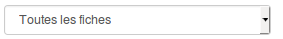

### Gérer les fiches réponses

---
La liste des fiches permet de consulter, chercher, éditer, ou encore supprimer les fiches existantes. 

Selon les configurations et vos droits d'accès trois tableaux peuvent vous être proposés. Pour choisir la liste que vous souhaitez voir afficher, il vous suffit de la sélectionner dans le menu déroulant en haut à gauche. 

Les trois tableaux possibles sont:

* "Toutes les fiches" - Ce tableau vous donnera accès à l'ensemble des fiches disponibles. Depuis ce tableau, vous aurez uniquement la possibilité de consulter ces fiches. 
* "Mes fiches" - Depuis ce tableau, vous pourrez toujours accéder aux fiches que vous avez complétées. Selon les autorisations accordées vous pourrez également les éditer ou les supprimer. 
* "Les fiches dont je suis gestionnaire" - Ce tableau vous permet d’accéder aux fiches appartenant à une ou des catégorie(s) dont vous êtes gestionnaire. Depuis cet affichage, vous pouvez publier, archiver éditer ou encore supprimer les fiches dont vous êtes responsables. 

Les différentes actions possibles sur les fiches sont indiquées dans la colonne action en bout de ligne. 

L'oeil permet de publier ou d'archiver la fiche. L'archivage consiste simplement à rendre la fiche "invisible" pour les utilisateurs. 
