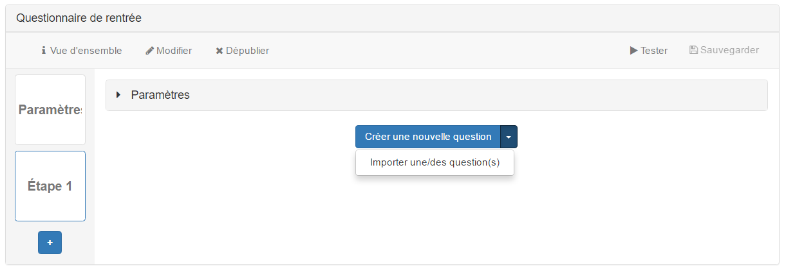

### Créer une question

---

Une fois dans l'étape, vous pouvez choisir entre créer une question ou en importer depuis votre banque de questions.
Pour créer une question cliquez sur "Créer une nouvelle question". Cliquez sur la flèche du même bouton pour afficher le bouton "importer une/des questions(s)".

