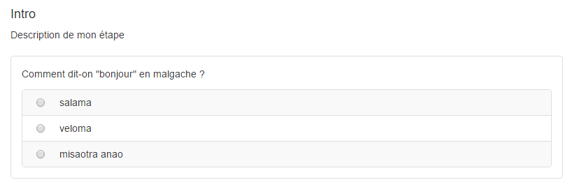

### Créer et paramétrer une étape

Une question est un sous-élément d'une étape. Avant de créer une question il faut donc créer son contenant : l'étape.

L'ensemble des questions contenues dans une étape seront sur la même page lors de la passation. Si vous faites un questionnaire avec 3 étapes, l'utilisateurs devra alors changer d'écran (cliquer sur "suivant") 3 fois au cours du questionnaire.
Les étapes peuvent aussi apparaitre dans un ordre aléatoire ou être tirées au hasard lors de la passation en fonction de comment vous avez choisi de configurer la passation (cf. [Paramétrer votre questionnaire](quiz_parameters.md) ).

Lorsque vous arrivez pour la première fois dans votre questionnaire, vous avez déjà une étape par défaut.

#### Créer une étape
Si vous souhaitez créer d'autres étapes il suffit de cliquer sur le "+" se trouvant sous l'étape existante : 

#### Paramétrer une étape

En cliquant sur "Paramètres" vous pourrez accéder aux paramètres de l'étape.

##### Le titre 
Vous pouvez donner un nom à votre étape. Il sera directement changé dans la vignette de gauche (comme ci-dessus avec le titre "intro") et sera visible lors de la passation de l'exercice par les utilisateurs.

##### La description
La description sera aussi visible lors de la passation comme vous pouvez le voir au dessus de la question ci-dessous.

##### Le nombre d'essais maximum
Ici, vous pouvez configurer le nombre maximum d'essais que l'utilisateur aura pour cette étape. 
