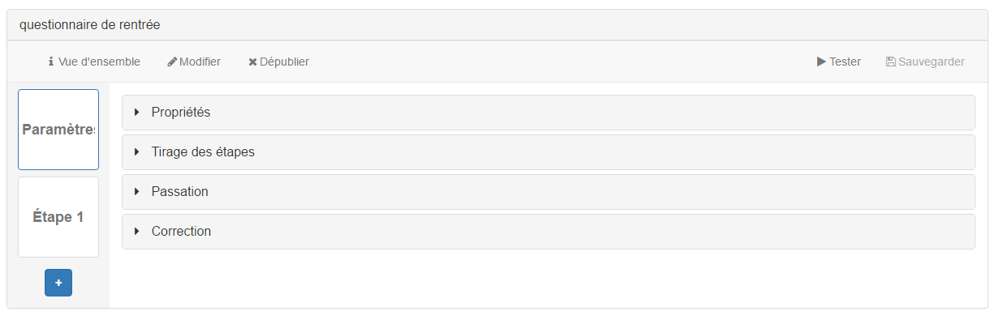

### Paramétrer votre questionnaire

---

> Cette fonction n'est accessible qu'aux personnes ayant des droits d'administration sur la ressource.

Les paramètres du questionnaire vont influencer tout ce qui concerne la passation, les scores et la correction. 

Vous pouvez modifier :
* Les propriétés générales de l'exercice,
* L'ordre et le tirage des étapes,
* les contraintes de passation
* la manière dont s'affichera la correction et le score.
