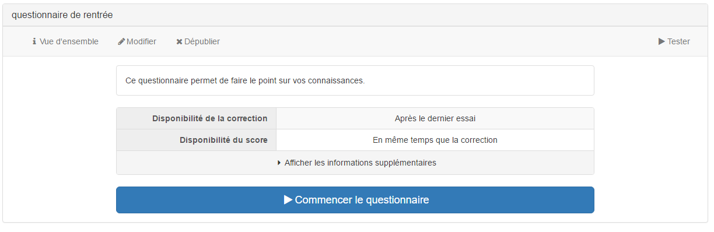

#### Propriétés du questionnaire

---

#####Titre
Vous pouvez modifier le titre original de votre questionnaire, mais ce champ ne peut pas rester vide

#####Description

La description de l'exercice que vous ferez dans ce champ sera visible par tous les utilisateurs dans la vue d'ensemble au-dessus du tableau contenant les informations concernant votre questionnaire.

#####Afficher les informations
En cochant cette case, tous les utilisateurs pourront voir le tableau contenant les informations concernant votre questionnaire dans la vue d'ensemble (comme ci-dessus). Si vous ne cochez pas cette case, les utilisateurs ne verront que le bouton "Commencer l'exercice" ainsi que la description s'il y en a une.
