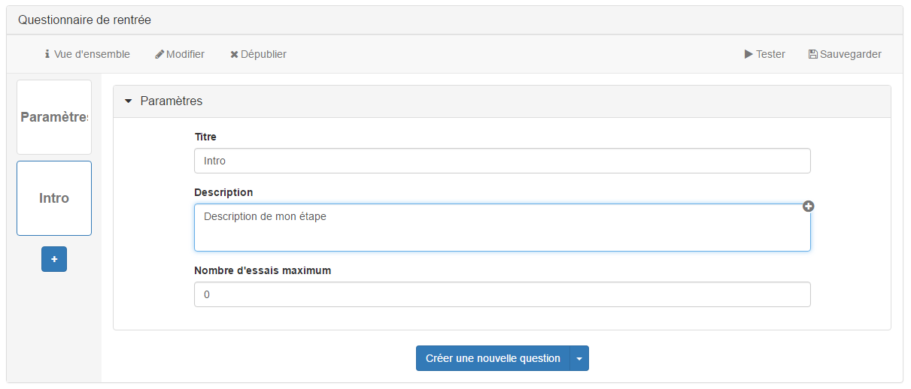
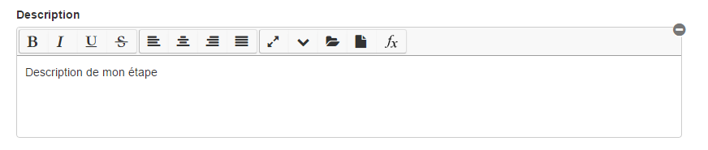

### Utiliser l'outil texte riche 

---

Pour plus de confort visuel, l'outil texte riche est systématiquement caché dans le questionnaire.
Les champs textes possédant un "+" en haut à droite sont ceux qui sont ceux qui possèdent les outils de texte riche.

En cliquant sur le "+" vous avez accès aux outils habituels de texte riche existant sur le reste de la plateforme.

Vous pouvez cliquer sur le "-" afin de cacher à nouveau ces outils.

