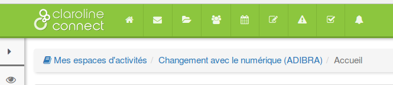

## La gestion des ressources

---

Il existe deux manières d'accéder au gestionnaire de ressources

* en cliquant sur l'icone **"ressources" **de la barre du menu à gauche d'un espace d'activités, vous accédez ainsi directement au **répertoire de ressources** de cet espace,

* en cliquant sur l'icône **"ressources"** de la barre de propriétés de votre bureau (bandeau supérieur), vous accédez à l'espace général des** "Ressources" de la plateforme** (qui contient par défaut les répertoires de tous les espaces d'activités créés).

