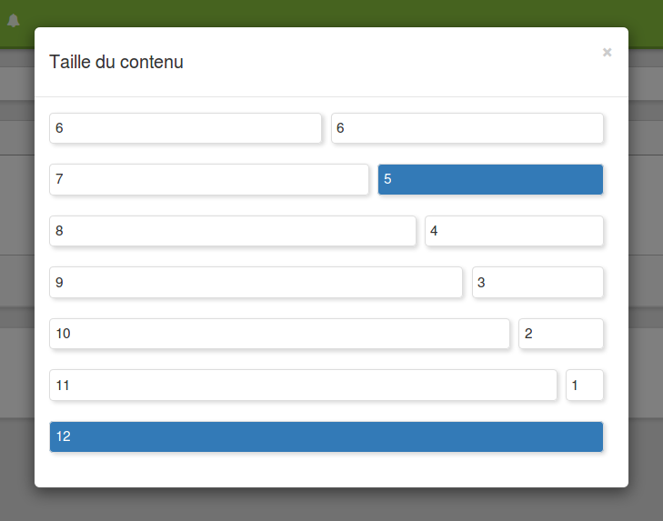

## Créer et paramétrer des articles

---

Pour créer un article, il suffit de mentionner un titre \(facultatif\), et de créer un contenu, c'est-à-dire de taper ou coller un texte dans l'emplacement prévu à cet effet, ou bien d'ajouter un lien s'il s'agit d'un contenu existant \(contenus hébergés par _YouTube_, _Vimeo_, _Flickr_, _SlideShare_, etc\).

**Paramétrer l'article**

Pour paramétrer l'affichage de l'article une fois qu'il a été créé, il suffit de cliquer sur la flèche vers le bas en haut à droite de l'encadré de l'article. Un menu déroulant offre alors plusieurs options.

L'outil **Taille** permet de définir la largeur occupée par l'article sur une page. Le fait de cliquer sur l'encadré avec les deux "6" permettrait par exemple de mettre deux articles de même largeur côte à côte.

L'outil **éditer** permet de modifier ou de mettre en forme l'article.

L'outil **Accordéon** permet d'ajouter un bouton "Lire la suite" de façon à éviter d'avoir un article trop long sur la page. Seul le début de l'article est alors visible et il faut cliquer sur le bouton pour le dérouler.

L'outil **Déplacer** permet de choisir l'emplacement de l'article. Il peut apparaître (par défaut) sur la page d'accueil, mais aussi sur une page précise (cf. infra pour la création de pages). Si une ou plusieurs pages ont été créées, alors le fait de cliquer sur **"Déplacer"** propose un menu déroulant qui permet de choisir la page d'affectation de l'article.

L'outil **Supprimer** permet de supprimer un article.