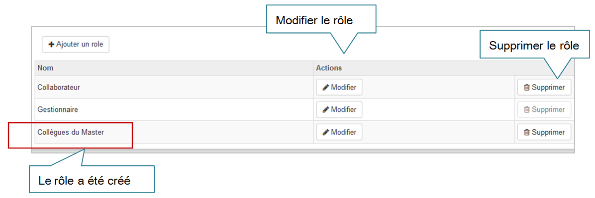

### Créer ou modifier un rôle
---

#### L'onglet "Rôle"

**Créer un rôle**

Comme expliqué dans la section [Les profils de Claroline Connect](../workspaces/les_roles_et_les_profils.md), la plateforme propose des rôles prédéfinis qui peuvent être personnalisés.

L'onglet "**Rôle**" permet **créer un nouveau rôle** auquel on attribue des droits spécifiques dans les paramètres de l'espace d'activité, ou dans les droits des ressources.
Pour ce faire, cliquez sur le bouton "**Ajouter un rôle**".

Figure 89 - Onglet "Rôles".

Vous avez également l'option de **créer un répertoire** dédié aux utilisateurs de ce groupe.

Figure 90 - Création automatique d'un répertoire de ressources.

Ainsi, il a été créé le rôle: **Collègues du Master**.

Figure 91 - Création de rôles.

**Modifier un rôle**

Pour modifier un rôle prédéfini, cliquez sur "Modifier":

Figure 92 - Modification d'un rôle.

Les rôles ont été modifiés.

**Comparez**:

Figure 93 - Résultat des modifications de rôles.

