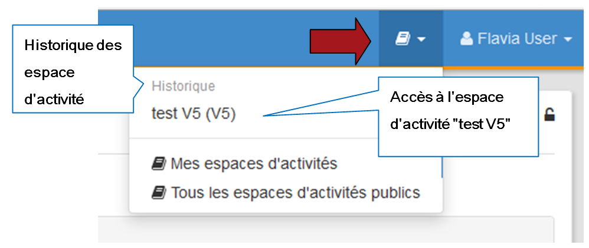

## Accéder à un espace d'activités

---

Il est possible d'accéder aux espaces d'activités publics, ou à ceux auxquels l'utilisateur est inscrit, à partir de **l'icône "espaces d'activités**" qui se trouve en haut à droite de la page d'accueil et qui va vous permettre également de créer des espaces d'activités (si vous en avez le droit).

Figure 39 - Accès aux espaces d'activités depuis la page d'accueil.

Il est possible d'accéder également aux espaces d'activités à partir **de la page d'accueil du bureau**. Pour faire cela, il est nécessaire que l'utilisateur ou l'administrateur de la plateforme ajoutent le widget "**Mes espaces d'activités**". (** Voir [gestion de la page d'accueil](../bureau/accueil_espace_perso.md) de son espace et/ou de son bureau personnel** )

Figure 39: Quand vous êtes dans un espace d'activités, l'icône "Espace d'activités" prend le nom de l'espace en question.

Figure 39: Quand vous êtes dans un espace d'activités, l'icône "Espace d'activités" prend le nom de l'espace en question.

