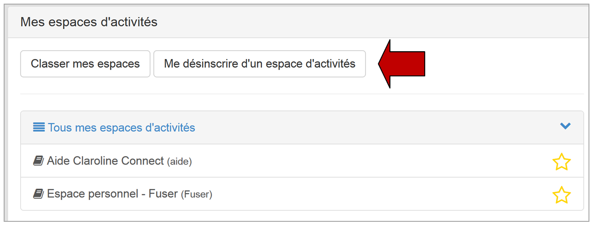
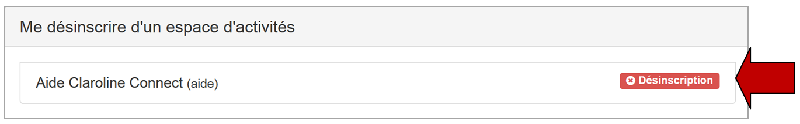

## Se désinscrire d'un espace d'activités
---

Cette possibilité doit avoir été prévue par le créateur de l'espace d'activités. Si ce dernier n'a pas autorisé la "**désinscription publique**" au moment de la création de l'espace, il ne sera pas possible pour un collaborateur de se désinscrire.

Toujours à partir de l'icône "**Espaces d'activités**" du bandeau supérieur, cliquez cette fois sur "**Mes espaces d'activités**" pour vous désinscrire d'un espace.

Figure 44: Cliquer sur "Mes espaces d'activités" pour vous désinscrire d'un espace

Figure 45: Quand vous cliquez sur "Me désinscrire d'un espace d'activités", les espaces qui autorisent la désinscription apparaissent.

Figure 46: Choisissez ensuite l'espace duquel vous souhaitez vous désinscrire.
