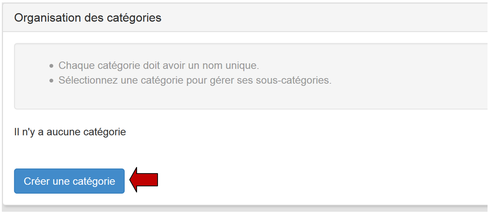
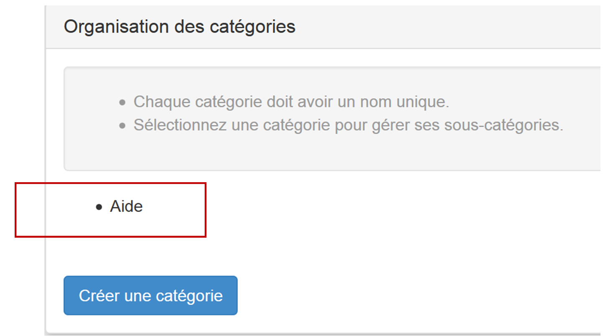
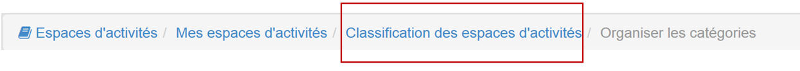

## Gérer ses espaces d'activités

---

La commande "**Mes espaces d'activités**" du menu supérieur permet de gérer ses espaces.

Figure 49: Gérer ses espaces à partir de la commande "Mes espaces d'activités"

1.Pour classer les espaces, vous devez créer une catégorie une fois que vous avez cliqué sur "**Classer mes espaces**",

Figure 50: Classer mes espaces

2.Cliquez sur "**Organiser les catégories**",

Figure 51: Organiser les catégories

3.Cliquez ensuite sur **créer une catégorie**:

Figure 52: Créer une catégorie

4.Nommez-la.

Figure 53: Nommer la catégorie

5.La catégorie "**Aide**" a été créée:

Figure 54 - La catégorie "Aide" apparaît dans l'organisation des catégories

6.En cliquant sur le **nom de la catégorie**, un menu se déroule vous permettant de renommer ou supprimer la catégorie, de créer ou d'ajouter une sous catégorie.

Figure 55 - Cliquer sur le nom de la catégorie pour afficher le menu déroulant

7.Il est important tenir compte des **instructions** suivantes :

Figure 56 - Instructions pour créer une catégorie.

8.Pour revenir en arrière utilisez le fil d'**ariane**:

Figure 57 - Utilisation du fil d'ariane.

9.Pour ajouter ensuite un espace d'activités à cette catégorie, il suffit de le **sélectionner** dans la liste en le cochant:

Figure 58: Sélectionner un espace d'activités dans la liste pour l'ajouter à la catégorie

10.Il reste à cliquer sur "**Classer par catégories**" pour l'ajouter à une catégorie existante en sélectionnant cette dernière dans la liste à puces de la fenêtre qui apparaît. (Dans l'exemple qui suit, il n'y a qu'une seule catégorie intitulée Aide).

Figure 59: Cliquer sur "valider" pour ajouter l'espace d'activités à la catégorie

11.Une **étiquette** est alors ajoutée à l'espace d'activités dans la colonne "**Catégories**" :

Figure 60: L'étiquette rouge indique que l'espace d'activités a été placé dans la catégorie "Aide"

12.Cette catégorie apparaît ensuite dans "**Mes espaces d'activités**":

Figure 61: La catégorie "Aide" apparaît das "Mes espaces d'activités"

Il suffit alors de **cliquer sur le nom de la catégorie** pour dérouler son contenu.
