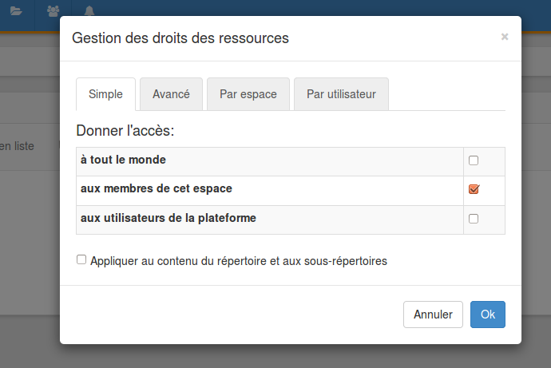
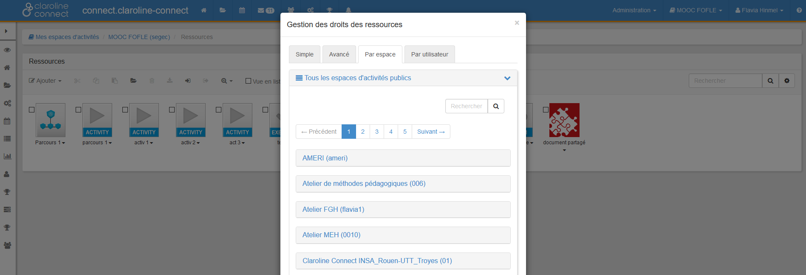

## Gérer les droits d'accès aux ressources
---
Vous pouvez gérer les droits d'accès aux ressources en fonction des profils, des espaces ou des utilisateurs. Il est possible de régler finement ces droits par type d'action (ouvrir, copier, exporter, éditer, supprimer) et par type de ressource (en cliquant sur “Options”). Rappelons que l'on peut éditer les droits d'un fichier particulier depuis le répertoire des ressources (cf. menu déroulant du fichier concerné).

Le tableau est composé de 4 onglets : Simple, Avancé, Par espace, Par utilisateur

**Simple**

Il permet de gérer les droits des ressources de manière générale.

Trois options vous sont proposées:

   * **à tout le monde** : permet l'accès public à la ressource
   
   * **aux membres de cet espace**: permet l'accès à ceux qui sont inscrits à l'espace d'activités concerné.
   
   * **aux utilisateurs de la plateforme**: permet l'accès à ceux qui sont inscrits à la plateforme.

Dans l'exemple ci-dessous, l'espace d'activités est accessible "aux membres de cet espace d'activités", c'est-à dire à ceux qui sont inscrits à l'espace d'activités concerné.

Si vous souhaitez propager les droits dans les répertoires et sous-répertoires du gestionnaire de ressources, cochez la case "**Appliquer au contenu du répertoire et aux sous-répertoires**."

Figure 137 - Gestion simple des droits sur les ressources.

**Avancé**

Vous permet de régler finement ces droits par type d'action (ouvrir, copier, exporter, éditer, supprimer) selon le profil.

Dans l'exemple, le collaborateur peut ouvrir et exporter les ressources.

Figure 138 - Gestion avancée des droits sur les ressources.

**Par espace**

Il s'agit d'un cas particulier. Il permet de donner accès à des ressources qui se trouvent dans un autre espace d'activités sans donner accès à l'utilisateur à tout l'espace d'activités.

**Exemple :**

Vos utilisateurs sont inscrits dans l'espace d'activités A et vous souhaitez leur donner accès à une ressource (blog, article, forum, wiki etc.) qui se trouve dans l'espace d'activités B.

   Allez à l'espace d'activité B (dans l'exemple : MOOC FOFLE) o ù se trouve la ressource dont vous souhaitez donner l'accès et cliquez sur **paramètres**. Ensuite cliquez sur **ressources** et choisissez l'onglet "**Par espace**".

Cliquez sur l'espace d'activités A auquel sont inscrits vos utilisateurs (A-Espace d'activités A (EAA) ). La liste des rôles de l'espace d'activités A se déroulera. **Sélectionnez le rôle** pour lequel vous souhaitez rendre la ressource accessible.

Figure 139 - Gestion des droits par espace d'activités.

A la fin de la page vous trouverez le tableau avec le type d'action (ouvrir, copier, exporter, éditer, supprimer) et le type de ressource (en cliquant sur "Options").

Figure 140 - Types d'action possible sur les droits.

**Par utilisateur**

Cet onglet sert également pour des cas particuliers. Il permet de donner les droits d'accès par utilisateur (un ou plusieurs).

Pour ajouter des utilisateurs il faut cliquer sur "**ajouter un utilisateur** ".

Figure 141 - Gestion des droits par utilisateur.

Cochez l'utilisateur souhaité et cliquez sur **OK**.

Figure 142 - Sélection de l'utilisateur.

L'utilisateur a été ajouté à l'onglet afin de lui donner des droits particuliers.

Figure 143 - Visualisation des droits donnés à un utilisateur.

### Gérer les droits d'accès depuis le répertoire des ressources
---
Vous pouvez donner les droits d'accès depuis le répertoire de ressources.

Cliquez sur la petite flèche à droite du nom de la ressource et choisissez « **éditer les droits** "

Figure 144 - Éditer les droits depuis le répertoire des ressources.

Sélectionnez les droits en fonction **des profils**,

Figure 145 - Sélection simple en fonction des profils.

Figure 146 - Sélection avancée en fonction des profils.

**des espaces,**

Figure 147 - Sélection en fonction des espaces.

ou **des utilisateurs**.

Figure 148 - Sélection en fonction des utilisateurs.

