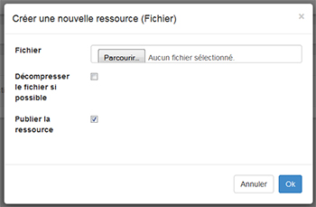
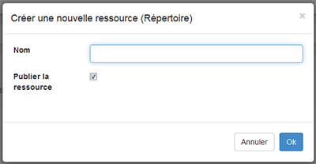

### La gestion et le dépôt de documents

---

Sur la plateforme **Claroline Connect**, vous pouvez déposer ou télécharger différents types de documents ou de fichiers.

Vous pouvez limiter les droits de diffusion de vos documents ou les mettre à disposition de vos étudiants.  
Le dépôt ou le téléchargement de documents se fait dans le gestionnaire des Ressources qui est accessible à partir de l'icône "Ressources" qui se trouve en haut à droite de la barre de propriété de votre bureau, ou à partir de la barre d'outils de votre espace d'activités.

Figure 164 - Icône d'ouverture des ressources.

Didacticiel Claroline Connect - Gestions des fichiers

1. Copiez des documents de votre ordinateur à Claroline Connect \("upload"\)

Pour transférer un fichier sur Claroline, positionnez vous préalablement :

* dans l'espace d'activités souhaité , puis cliquez sur l'icône "ressources" de la barre de ressources,
* dans le gestionnaire des ressources de votre bureau

<iframe width="665" height="150" src="https://www.youtube.com/embed/RnGGKNB7F8k" frameborder="0" allowfullscreen></iframe>

Figure 165 - Vidéo: Gestion des fichiers.

**Solution par le menu**

Cliquez sur Ajouter -&gt; Fichier pour appeler la fenêtre du sélecteur de ressources et sélectionner un fichier à l'aide de l'onglet **Parcourir**. Cliquez sur Ok. Le fichier, après téléchargement, apparaîtra dans vos ressources.

Figure 166 - Sélection d'un fichier.

Figure 167 - Sélection d'un fichier.

**Solution Drag and Drop**

Toujours dans le gestionnaire des ressources, positionnez-vous à l'endroit ou vous voulez uploader vos fichiers, sélectionnez un ou plusieurs fichiers et faites un simple glisser/déposer de votre ordinateur à Claroline Connect.

**Solution Zip**

Transférez un fichier Zip \(contenant un ensemble de fichiers\) par une des méthodes décrites ci-dessus en n'oubliant pas de le décompresser directement en cochant la case "Décompresser le fichier si possible".

Figure 168 - Décompresser le fichier.

1. Téléchargez un document de Claroline Connect sur votre ordinateur

Pour télécharger un document de Claroline sur votre ordinateur, cliquez sur les **Options** du fichier \(flèche à droite du nom de fichier\), et sélectionnez **Télécharger**.

Figure 169 - Télécharger un fichier.

1. Créer un raccourci pour une ressource

Claroline Connect vous permet de créer des raccourcis afin de pointer sur une ressource \(quel que soit l'espace d'activités\) sans changer son emplacement d'origine \(le contraire d'importer\). Cela permet d'avoir un fichier original et de le modifier à la source.

Pour créer un raccourci, cliquez sur l'onglet "Ajouter" -&gt; "Raccourcis". Une fois créé le raccourci apparaît dans l'espace des ressources sous la forme d'une icône avec une flèche bleue.

Figure 170 - Créer un raccourci.

Figure 171 - Créer un raccourci.

1. Importer des ressources

Importer une ressource équivaut à créer un doublon : vous allez récupérer une ressource existante d'un espace d'activités et la copier dans un autre espace.

Attention : si le fichier d'origine est modifié, la copie ne sera pas modifiée.

Pour importer une ressource, cliquez sur l'icône 2034.png et sélectionnez le fichier souhaité grâce au sélecteur de ressources.

Figure 172 - Sélectionner une ressource à importer.

Une fois la ressource importée, elle apparaîtra dans l'espace Ressources de l'espace d'activités souhaité.

1. Organisez vos ressources en créant des répertoires et des sous-répertoires

Sur Claroline Connect, vous pouvez organiser vos ressources à l'aide de répertoires \(ou dossiers\) et de sous-répertoires.

Pour créer un répertoire, cliquez sur l'onglet **Répertoire** du menu "créer".

Donnez un nom à votre répertoire dans la fenêtre **Répertoire**, puis cliquez sur OK

Figure 173 - Créer un répertoire.

Le répertoire ainsi créé apparaîtra alors dans l'espace ressources de votre espace d'activités.

Figure 174 - Résultat de la création d'un répertoire.

Vous pouvez créer autant de répertoires et de sous-répertoires que vous le souhaitez.

